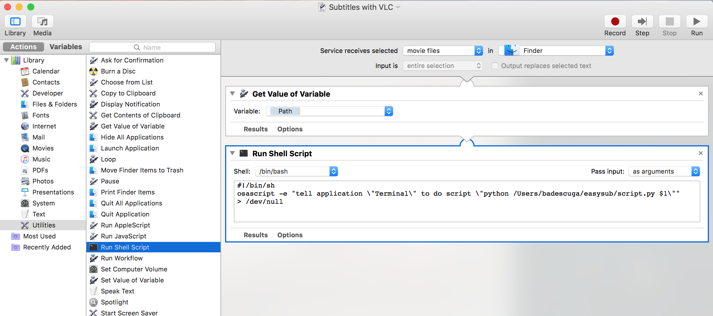

# easysub
python script for downloading subtitles(using subliminal package) and auto-play with automation services in OS X.

Installation
----------

Due to some problems with Apple's built-in python, i decided to go with a custom AppleScript in the automation/services that launches a python script in a terminal that actually does all the work. I also recommend installing a new python version using [Hombrew](http://brew.sh/).

- install pip.
- <code>pip install subliminal</code> in terminal.
- enter automation/services and add the newTerminal.sh code to a shell command and pass it the location of your .py script. Be sure to also add the <code>Path</code> variable to the <code>Get Value of Variable</code>.

- you can configure your own media player for play, i went with VLC.

